# 动态内存分配

## 基本概念

### 定义

程序员使用**动态内存分配器**比如C语言中的malloc或者java中的new，来获得VM上的空间

**注意**：当我们的数据结构的大小，只有在**运行时才知道大小**时，使用malloc。

动态内存分配器：管理VM中的heap区域，维护heap,heap由一系列不同大小的块（block）组成，block分成两种状态：**allocated**/已分配，或者**free**/已释放

分配器的种类：1，显式分配器：应用程序需要手动的分配和释放空间。2，隐式分配器:应用程序只需要分配空间，但是不需要释放空间（java）

### malloc包

包括在lib中，主要有以下函数：malloc：分配空间，返回指针，free：释放空间，calloc:分配空间并初始化

realloc：改变已分配块的大小，sbrk：分配器增加或者减少heap大小。

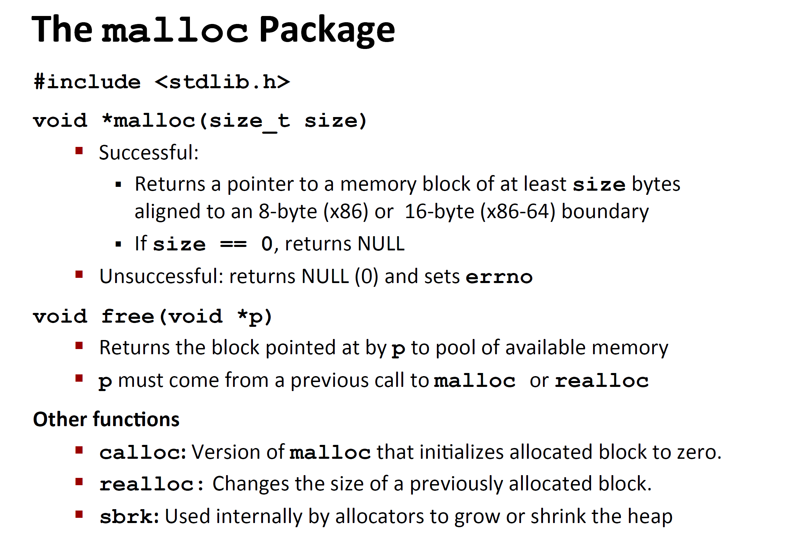

举例：

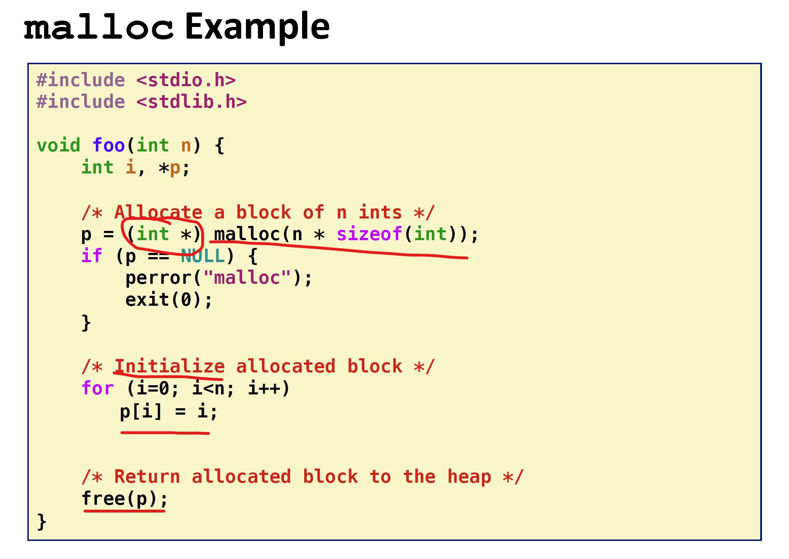

注意：

1. 返回的类型默认void *，需要显式转换类型
2. 调用系统函数记得检查返回值
3. 记得初始化以及释放空间

**接下来举例都是以word作为基本地址单位，一个word是4个字节**

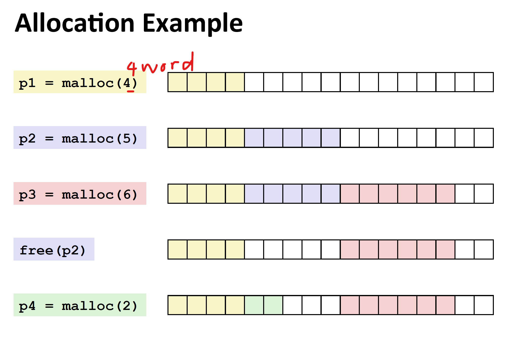

### 分配器的局限性

应用程序分配和回收空间基本没有限制，但是分配器真正在heap上分配和回收block时，却有着很多限制：

1. 无法控制已分配块的数量和大小
2. 必须立即响应malloc函数，不能延迟
3. 只能在free block中分配内存
4. 必须保证地址对其（64位系统按16字节对齐）
5. 只能操作和修改free blocks
6. 不能移动已分配块

所以，如何设计分配器，使它能快速的进行分配/释放，同时还得保证内存使用效率，是一个难点。

描述其响应malloc/free等请求的速度，用吞吐量表示：

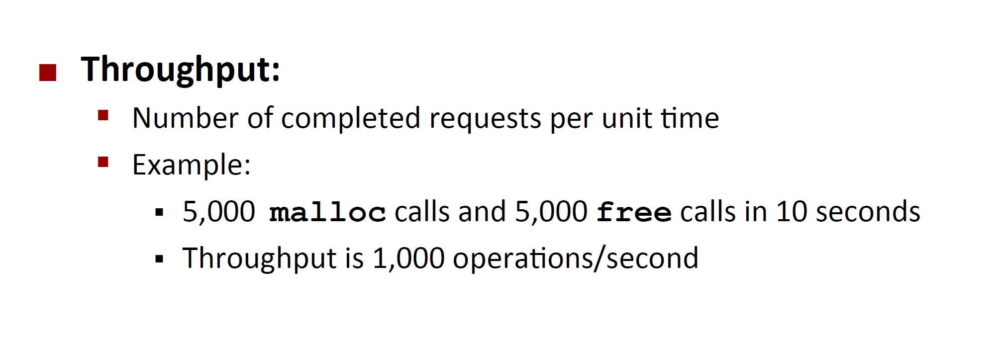

假设malloc请求分配p个字节的地址，p称为有效开销，当进行了k次请求后，总的有效开销称为pk，此时heap的大小为Hk，则定义内存利用率为：

### 碎片

分类：分为外部碎片和内部碎片

内部碎片是指：在已分配块中，除去**有效开销**的区域。

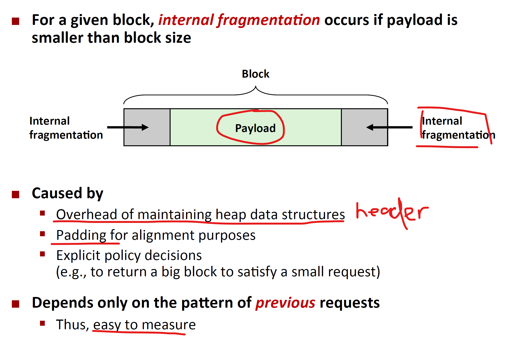

造成原因：可能是因为需要对齐地址，也因为维护heap，需要多余的数据来定义块。

外部碎片：当前heap有足够的空间，但是无法满足malloc的要求，如下图：

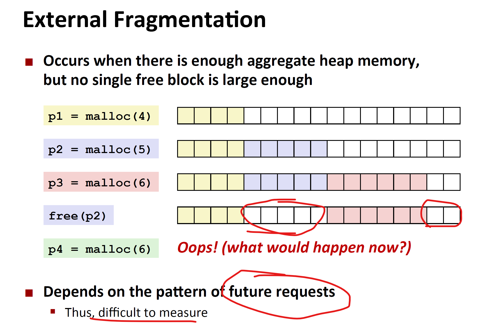

### 细节（分配器到底如何工作的呢）

Q：

1. 分配器怎样知道要释放多少空间呢（只给了一个指针）？
2. 分配器怎样找到free block呢？
3. 当我们想要分配的block，比它将要放入的free block小时，会多出来一部分空间，如何处理呢？
4. 有很多free block可供选择时，如何选择呢？

#### 如何确定block的大小

使用header：header在payload之前，表示这个block的大小。（内部碎片）

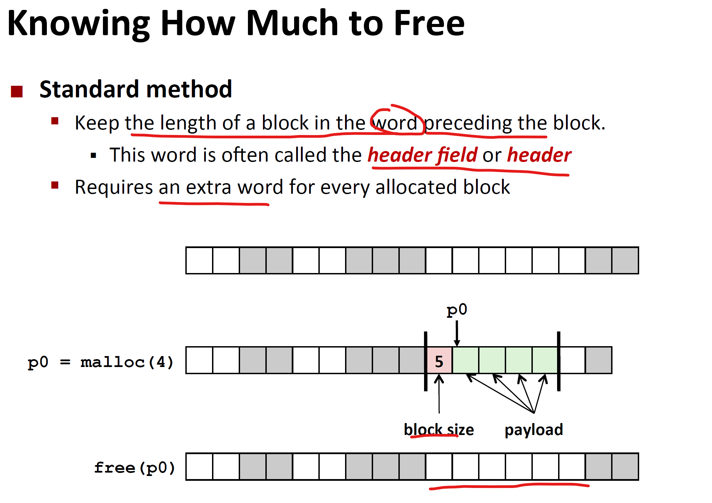

#### 如何找到free blocks

有以下几种策略：

1. 隐式链表：用Pointer指向第一个块的header，可以计算出下一个块的header，从而实现heap的遍历
2. 显式链表：每一个块的header之后还存储着下一个free block的head地址，从而可以遍历所有free block。
3. 分割的空闲列表：根据不同的块空间，分配不同的链表，便于查找。
4. 红黑树/平衡树：将所有free block的指针以及长度存储在树中。

接下来将详细介绍隐式链表的工作原理

## 隐式空闲链表

### 使用隐式空闲链表的block结构

地址对齐带来的好处：所有block的地址的最后三位/四位是0，因为block大小必须是8/16字节的整数

所以：**header的后三位其实都是0**，可以供我们使用

Trick：最后一位是1，表示已分配，最后一位是0，表示空闲（free）

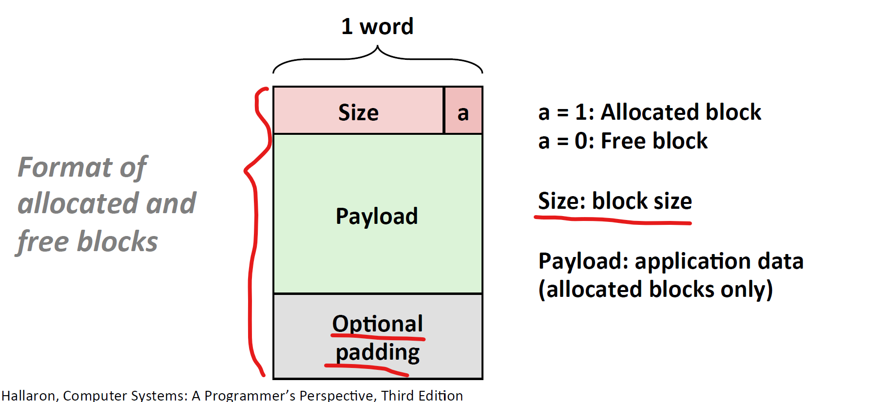

### 使用隐式空闲链表找到空闲块

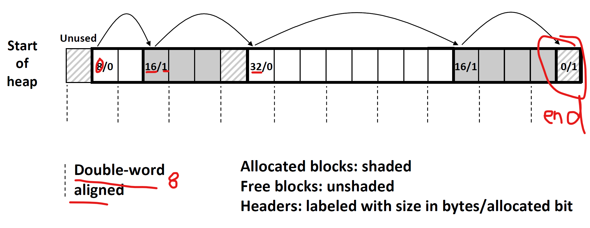

有如下几种策略：

1. 从头开始查找：从头开始，找到比我们要求分配的空间大的第一个free block。
2. 在上一次搜索完成处开始查找（研究表明与策略1比，会使碎片化更严重）
3. 最适合查找：找到空间最适合的空闲块。

策略1代码举例：

p；从头开始，p < end：表示没到达末尾， *p & 1：判断末尾是0还是1。 *p：表示当前块的大小。

### 使用隐式空闲链表分配空间

找到了目标free block后，有两种策略：1，把这个空闲块分成两半，得到一个分配块和一个小的空闲块。2，不分半，得到一个分配块。下图展示的是**分割**，即第一种策略。

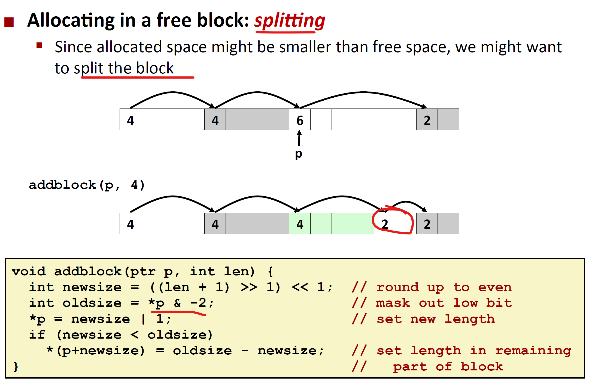

### 使用隐式空闲链表释放空间

也有两种策略，1，直接释放。2，释放后与相邻的空闲块合并。显然使用第一种策略，会造成许多小的空闲块，所以通常使用策略2.

#### 单向合并：只能合并后面的空闲块

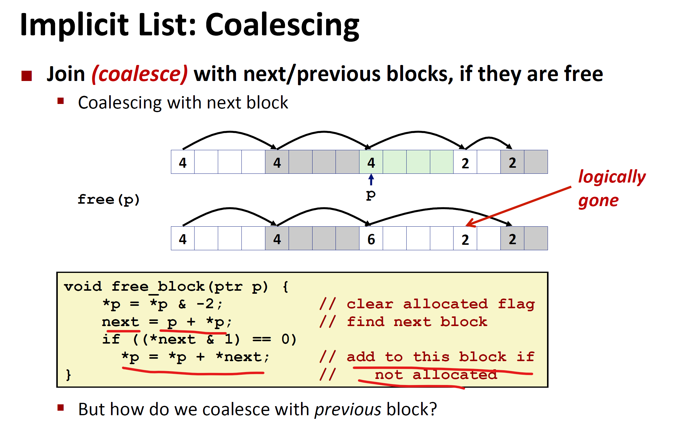

#### 双向合并：使用边界标志（footer）

在每个block的尾部增加一个边界word，和header一模一样，这样，我们就能通过访问当前header的前一个字，获得前面block是否为空闲：

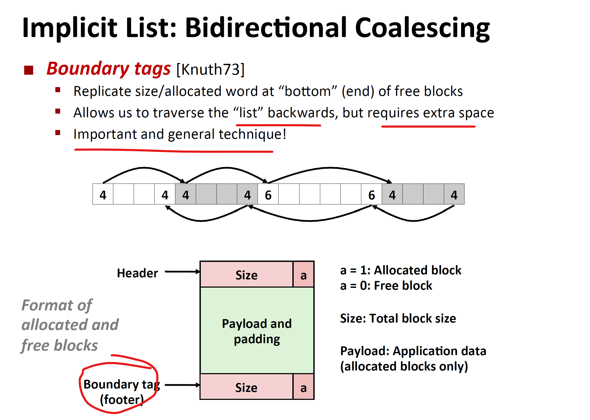

释放空间举例：

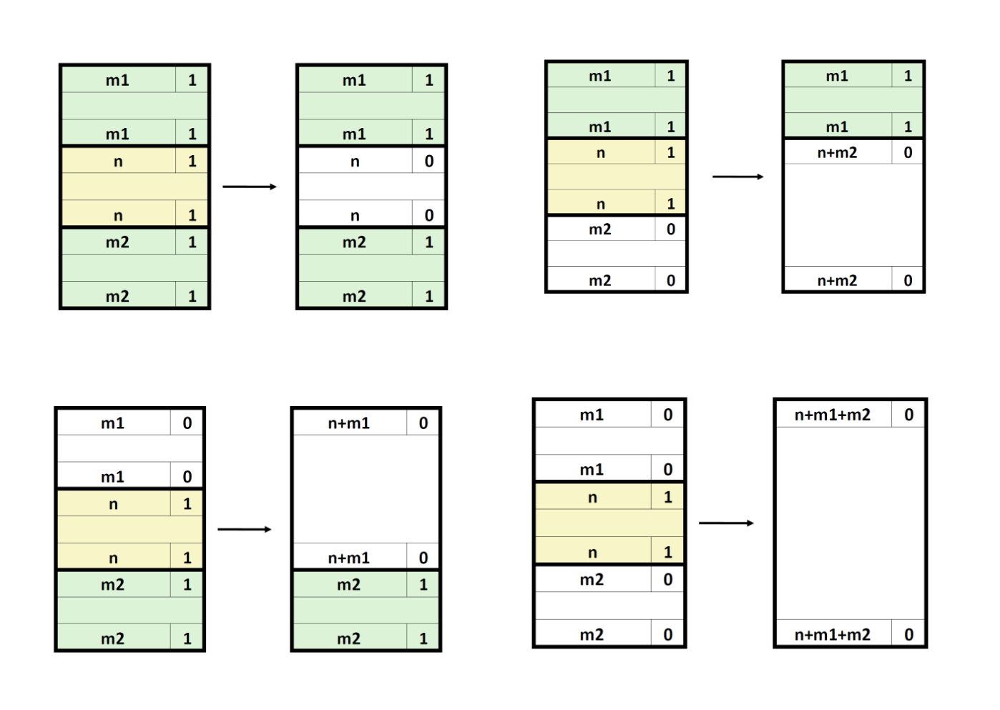

四种情况：不合并，向前合并，向后合并，双向合并（合并时，只需要找到header，然后修改以下长度/末尾位即可）

**footer优化**：allocated block不需要footer，只需要在当前Header的到数第二位设置为0/1:0表示它前面的块是空闲的，可以访问到footer进行合并，1表示前面的块已经被分配，不能合并，这样可以节省空间。

### 隐式空闲链表总结

隐式空闲链表找空闲块（malloc）需要遍历整个heap，效率很低，所以在实际中一般不用，但是我们学到的分割策略/释放策略在常数时间可以完成，是很有用的。

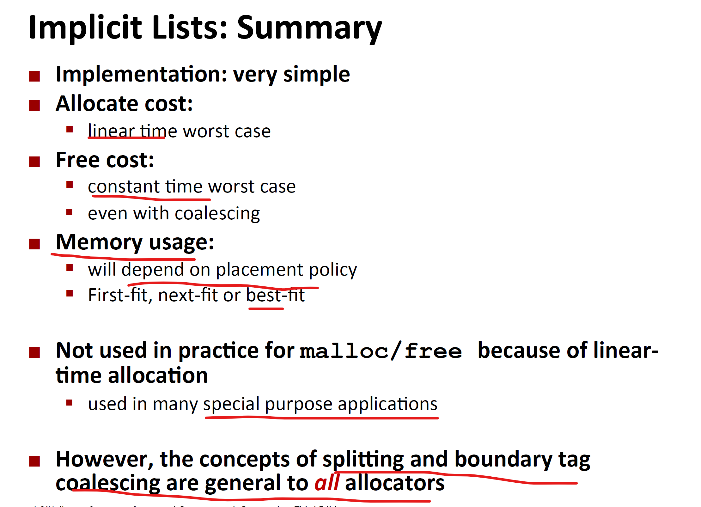

## 显式空闲链表

### 实现方式

在空闲块中存放着下一个空闲块和上一个空闲块的指针，如下：

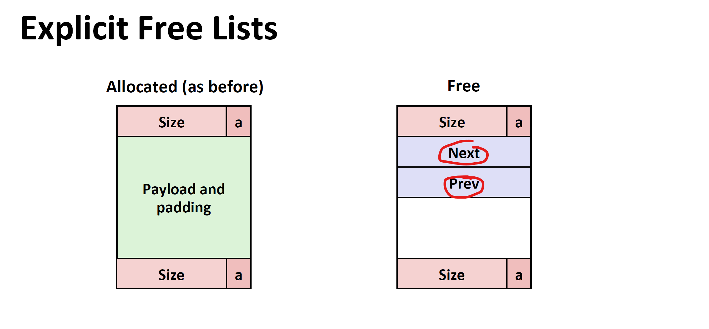

可以发现：1，双向链表结构。2，两个指针占用了free block的payload空间。3，所以free block最小得为4

### 排列方式

随机，不一定是按照真正的free block在VM的相对顺序排列

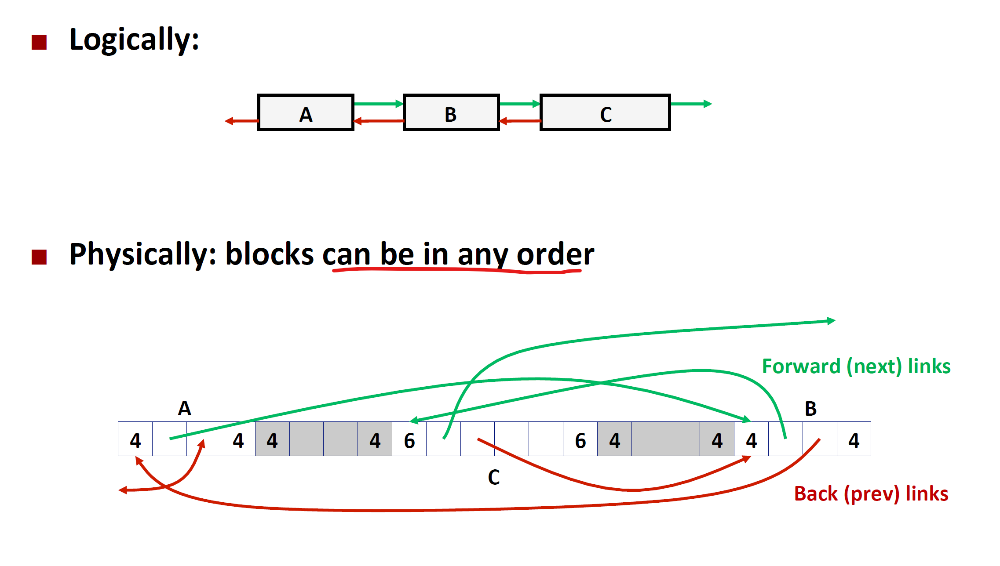

### 分配空闲块

需要移动6个指针

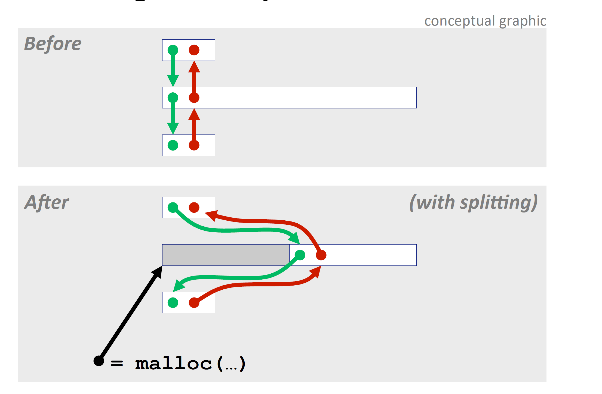

### 释放已分配块

当新释放出来的空闲块，应该放在链表中的哪个位置呢？两种策略：

1. LIFO：新的空闲块总是在链表头部。优点：常数时间插入。缺点：比策略2造成了更多的碎片
2. 按照地址顺序排序后插入：优点：碎片少。缺点：插入时需要搜索。

### 释放已分配块的常见四种情况

1,前后都是已分配的块。2，后面是未分配的块。3，前面是未分配的块。4，前后都是空闲块。

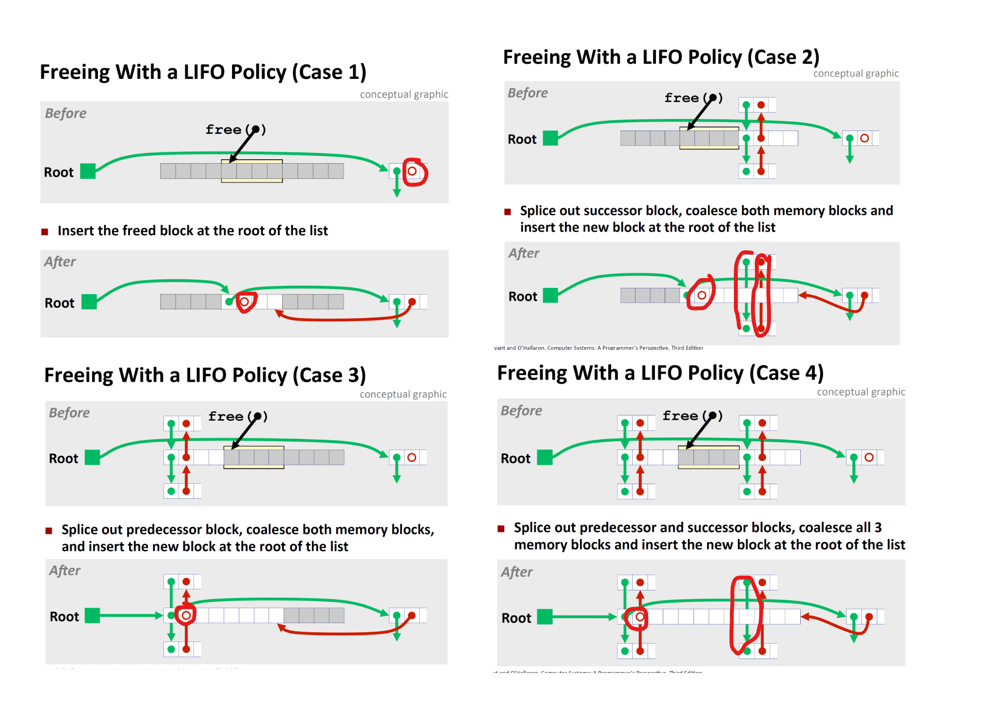

### 显式空闲链表总结

- 相比于隐式，malloc的时间更快
- 比隐式稍微复杂
- 需要更多的空间来存储pre/next指针

## 分区（分割）空闲链表

### 实现方式

segregated list（Seglist），在每一个**大小区间**内，维护着一个空闲块链表。

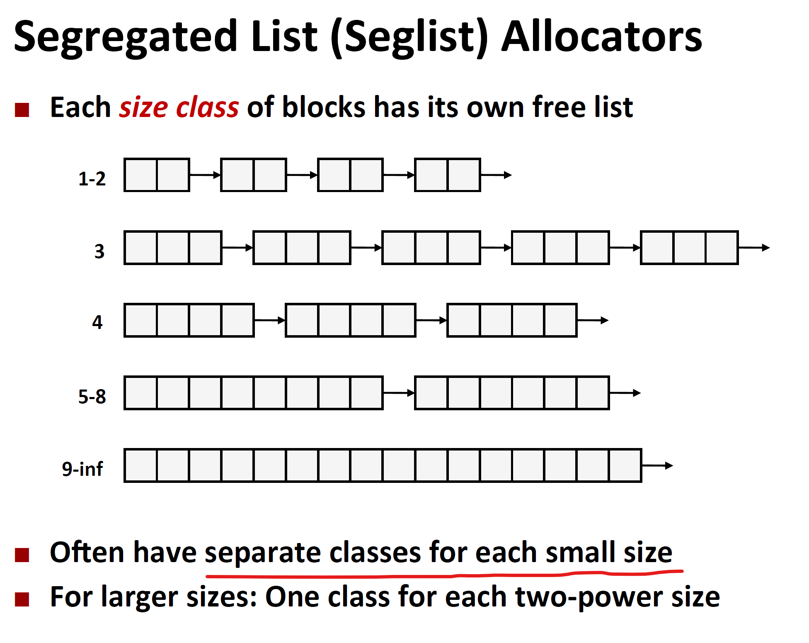

对于一些常用的小空闲块，定义了区间，大的空闲块，区间很大。

### Seglist分配器

维护着一个free list的数组，每个都指向着一个空闲区间。

#### 分配空闲块

1. 查找到合适的free list
2. 在区间内找到合适的空闲块，将分割的空闲块放在合适的free list。
3. 如何在当前的free list中没有找到，则在更大的区间内寻找
4. 直到合适的空闲块找到
5. 如果所有free list中，都没有合适的空闲块，则OS调用sbrk()，增加heap分配所需字节。

#### 释放已分配块

和之前一样，前后连接后，放在合适的free list。

#### 优势

- 具有更大的吞吐量（处理malloc更快）：因为很块能找到合适的block
- 具有更高的内存利用率：因为将块分成不同区域，可以找到大小合适的block。

所以seglist方式存储空闲块的分配器应用广泛。

PS：存储着free list的数组，存放在Heap的开头。

## 垃圾回收

### 定义

什么是垃圾：不会再使用的heap中的数据。

垃圾回收：能自动回收heap中的数据，而不需要应用程序来调用free释放空间，称为垃圾回收。

哪些语言支持垃圾回收：在许多的动态语言，如Python，Java，Ruby，Perl等

C和C++仅支持很谨慎的垃圾回收器（变体/Variants）：不能做到所有垃圾的回收。

### 机制

#### 前提条件

怎么知道哪些内存需要释放：当一个块没有指针指向它时，它就永远不会被使用了，此时可以释放它。

此时需要对指针做出以下规定：

1. 首先内存管理器能够分辨出指针类和非指针类（C/C++显然不行，因为指针也可以被当作整数。。）
2. 所有指针都必须指向头部（C/C++不行，他们的指针可以指向块的内部，这样内存释放不完全）
3. 不能隐藏指针（被分配成静态类型？？？不懂。。总之不能说把指针强制转换成整数，接着又把整数转换成指针）

#### 如何判断垃圾

* 将内存（heap部分）看成有向图：其中，每个allocated block可以看成节点，每一个指针看成是边（此处的指针不是free list的指针！！），存储在寄存器，stack，全局变量的指针，作为根节点。
* 垃圾：当一个块不能从根节点出发访问时，被看成垃圾（因为不能被应用程序访问了）

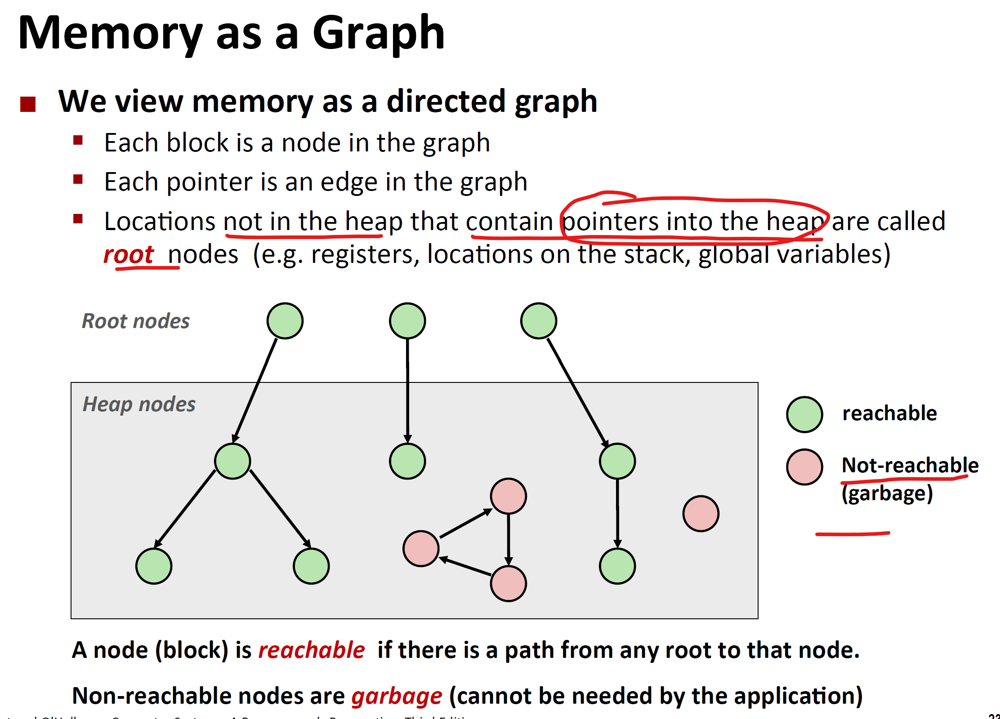

#### 标记/回收垃圾

当heap的大小到达设定值，可以对heap中的垃圾进行清理，分为标记（mark）和清扫（sweep）两个步骤：

标记：使用header的三个（或四个）空闲位作为标记位，从根节点出发，遍历所有能到达的块，设置mark bit。

清扫：从heap头部开始，遍历所有block，对没有被标记的已分配节点free。

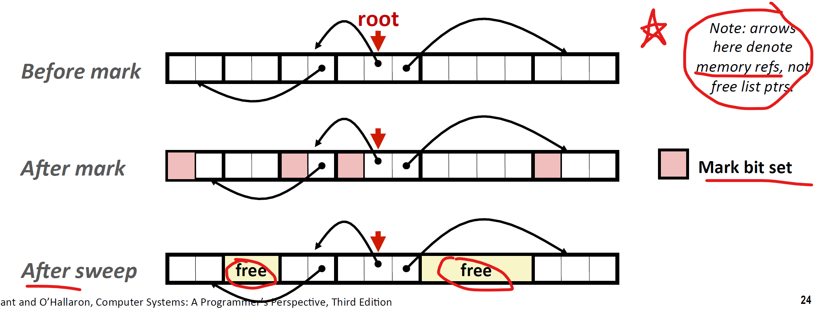

这里的箭头表示block间的指针，不是free list中的指针！

#### 简单的垃圾回收器

首先，垃圾回收器需要用到如下指令：

1. is_ptr(p)：判断是否为指针
2. length(p)：判断块的长度
3. get_roots()：返回所有的roots
4. b[-1]：表示block的头部

应用程序如何操作block呢（由于不能改变指针p的位置）（java等）

1. new(n):malloc
2. read(b,i)：访问block的i处位置数据
3. write(b,i,v)：将block的i处数据写成v

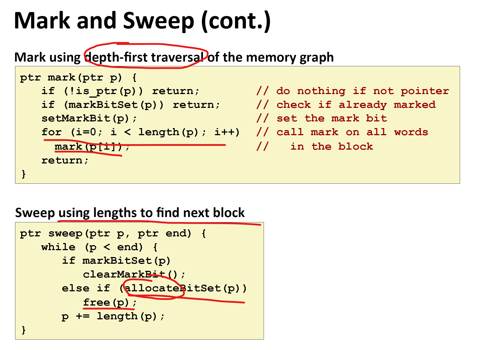

DFS遍历所有可到达节点。

## 动态内存分配常见Bug

### 指针

涉及内存的Bug通常和指针相关，首先我们需要读懂指针，读指针要按照优先级从指针遍历开始，从内到达，按优先级读。参考资料：CPP Primer

### 常见Bug

* 忘记取地址，在应该传地址的地方，传入的是地址处的数据（传入整数）。

* 忘记初始化地址（C/C++中一定要记得初始化你new的数据）
* 超出地址范围
  * 可能分配了错误的block大小
  * 可能访问超过block空间

如上图：int和指针的大小可能不一样（在64位中会出错），并且超过了N的空间	

* 超出地址范围
  * 没有检查string的大小（buffer overflow attack）
  * 没有理解指针算法：p++，表示指针移动它类型的距离
  * 忘记优先级：*size--：会先把size这个指针--,然后再解引用
* return局部变量地址：局部变量会被释放掉，返回它的地址无意义。
* 多次释放block，会造成错误，不知道为啥。。
* 指向已经释放的地址（free block）
* 忘记free block！

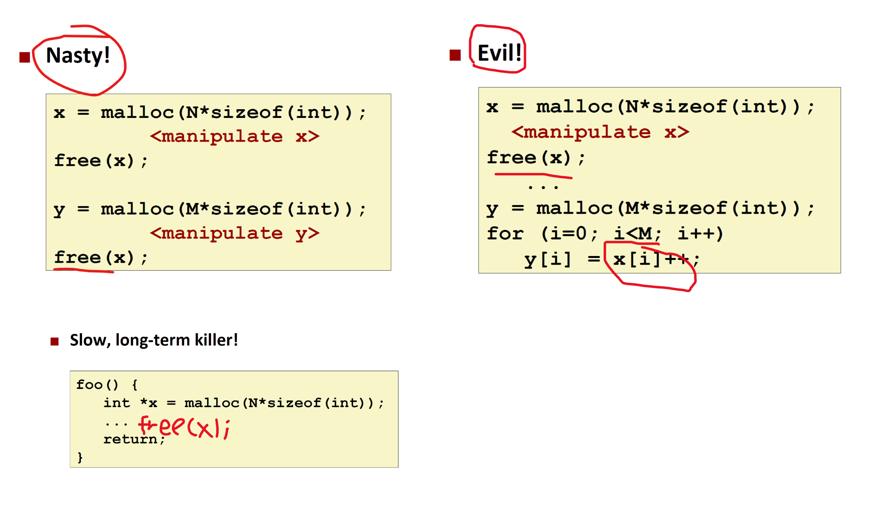