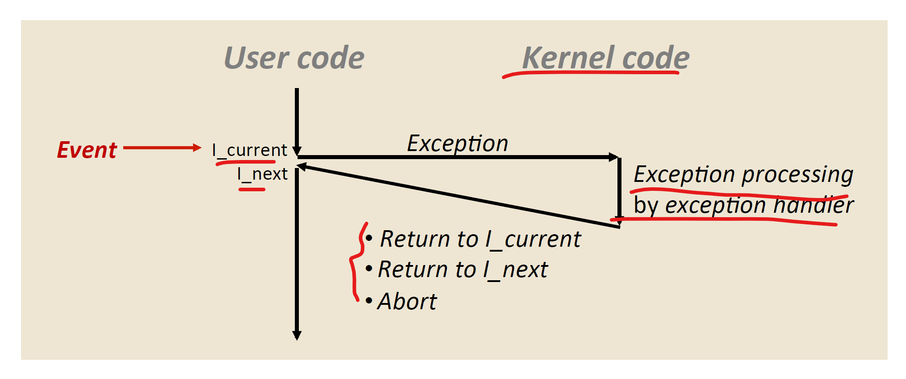
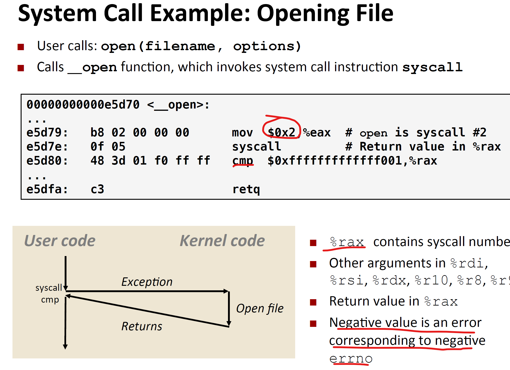
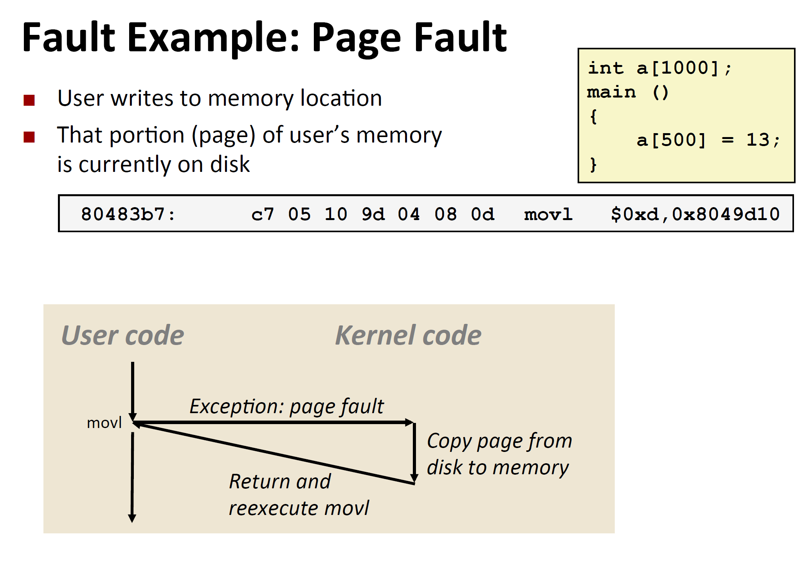
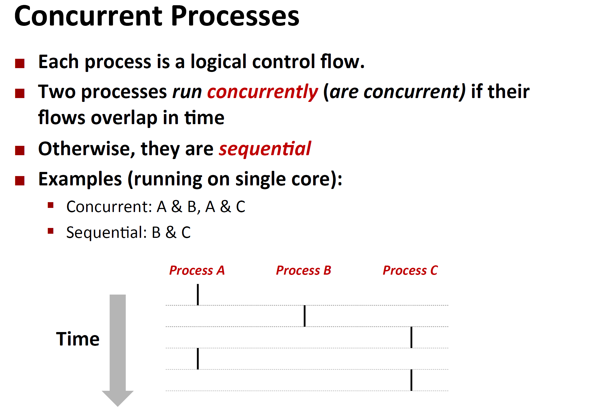
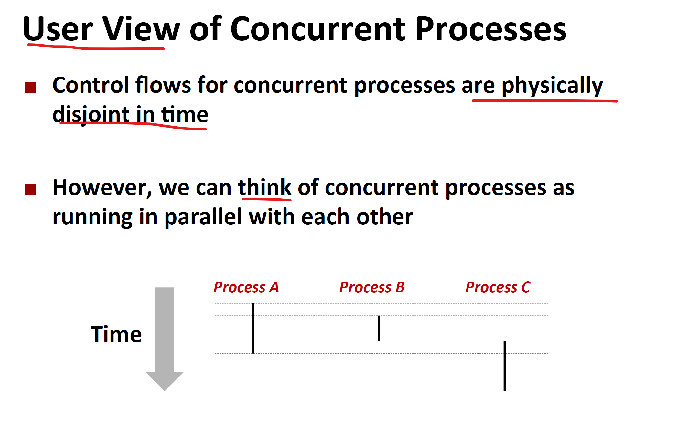

# 异常控制流

## 异常控制流定义

### 什么是控制流

从计算机启动到关闭，CPU做的仅仅是处理一系列**顺序**的指令，一次一条。这个顺序指令叫做CPU的控制流。

### 如何改变控制流

迄今为止已经学习了软件方面的控制流改变：1，branches/jumps 2，call/return。这两种改变都是针对“程序状态”

对于“系统级状态”的改变，控制流应该如何处理呢？比如磁盘数据上载到内存，或者程序除以0，或者键盘按下ctrl+c，或者**系统计时器**终止等等，控制流需要靠“异常控制流”的机制应对。

### 异常控制流

存在于计算机的各个层级，分别如下

1. 异常：当发生了系统事件（system event）时，比如系统状态改变等，需要产生一个“异常”来处理，需要硬件和操作系统软件的配合
2. 进程上下文转换：需要硬件计时器和操作系统软件配合
3. 信号:由操作系统软件控制
4. 非本地跳转：由C的runtime library控制

## 异常

### 定义

异常是指为了响应某一**事件event**，控制权由当前执行的程序转移到操作系统内核（OS kernel）

内核：操作系统内存常驻部分

常见**事件event**：除以0，计算溢出，页缺失（page faults），I/O请求完成，键入ctrl+c等等

**事件**处理过程如下

可以发现：在kernel的异常处理器处理完成了，有三种情况。

可以发现：内核中有一张异常表，每一种事件都对应着一个编号，供查到对应的处理程序。

### 异常分类

#### 异步异常

发生在处理器外部的事件引起的异常，通过处理器的中断引脚（interrupt pin）传给处理器，并且异常处理器（exception handler）完成后，会接着处理原控制流的下一条指令（next）

举例：

可以发现：timer interrupt可以帮助内核掌握控制权。

#### 同步异常

由于执行某一条指令发生的异常

分类：

陷阱traps,错误faults，中止aborts。

可以发现：traps可以恢复，且是当前程序主动请求的，比如请求system call系统调用，来调用系统函数，faults不是主动请求的而是不可能预测的，发生faults时，程序后能会在原处（不是next）接着重新运行，也可能中断

常见system call符号：

上图为系统调用举例

上图为页缺失举例：当前内存没有所需要的地址a[500]，从磁盘中调用

上图为页缺失的另一种情况：当为错误地址时，发出signal

## 进程

### 进程定义

定义：进程是指运行程序的一个实例（因为运行的程序可能有多种存在形式，比如.c,.o,.text或者加载到了内存中）

两大关键抽象

* 逻辑控制流：每个进程看上去都在单独的在使用CPU，通过OS的”上下文切换“机制产生
* 私有地址空间：每个进程看上去都在单独的使用内存，通过”虚拟内存“的机制产生。

多进程的假象：看上去同时运行着多个进程，每个进程都在使用CPU和内存。

传统单核处理器处理多进程：交错处理，进行多进程转换时，先把当前**寄存器中的值和地址空间存**在内存中，然后转到另一个进程执行，当执行另一个进程时，把那个进程之前存好的寄存器值和地址空间读取出来即可

现代多核处理器处理多进程：依然是共享内存和一些缓存，但是每一个核都可以处理一个进程了，进程数超过核心数，也要进行**上下文切换**

多进程的并发性：如果在进程A的逻辑控制流核进程B的逻辑控制流时间交叠，则称这两个进程是并发的（实际在物理层面，它们并没有交叠）比如下图

A/B,A/C**并发**，B/C**顺序**

