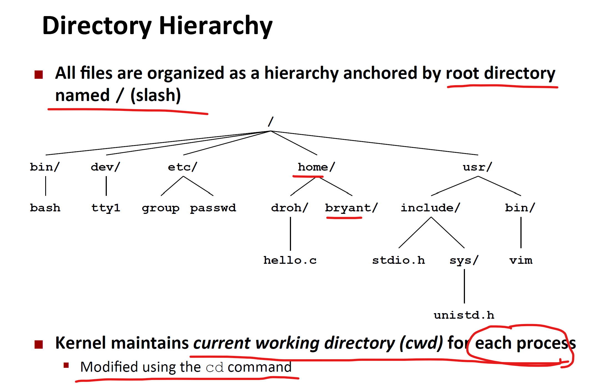
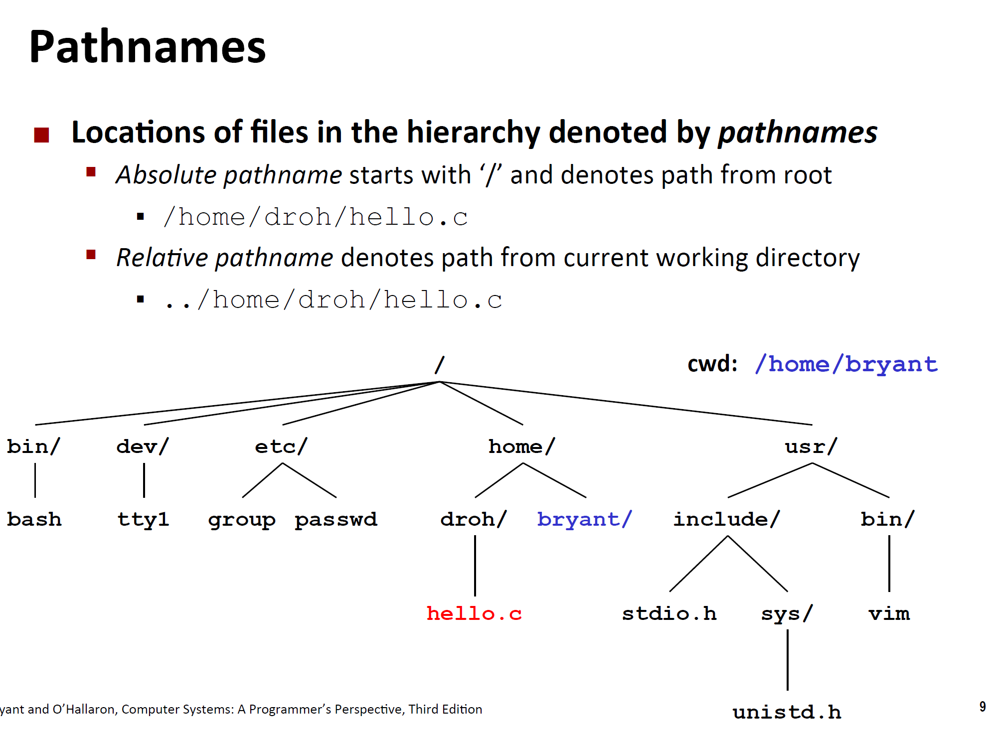
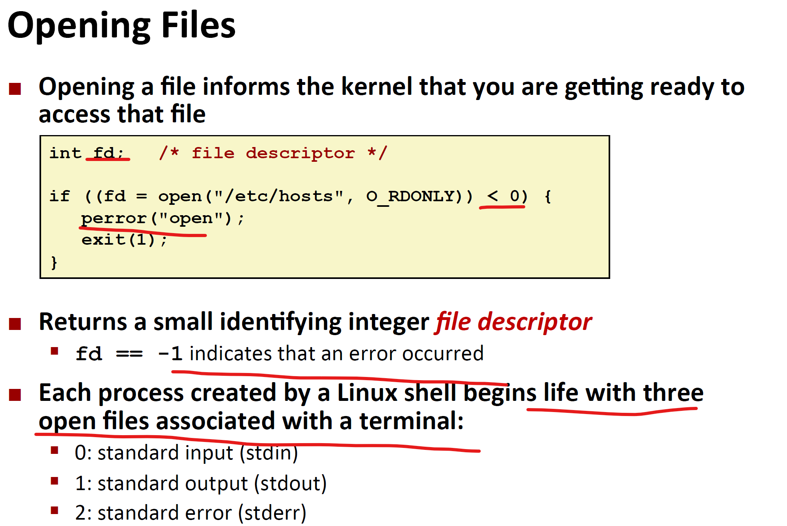
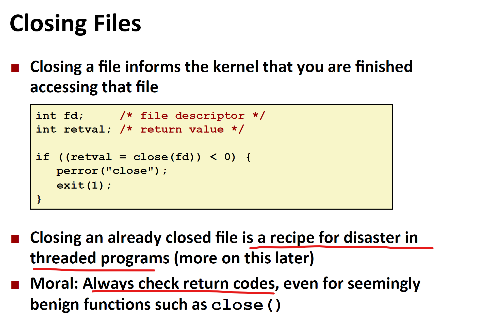
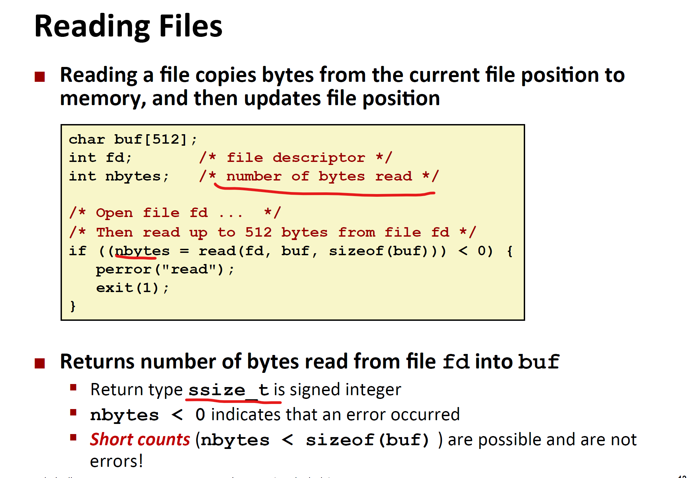
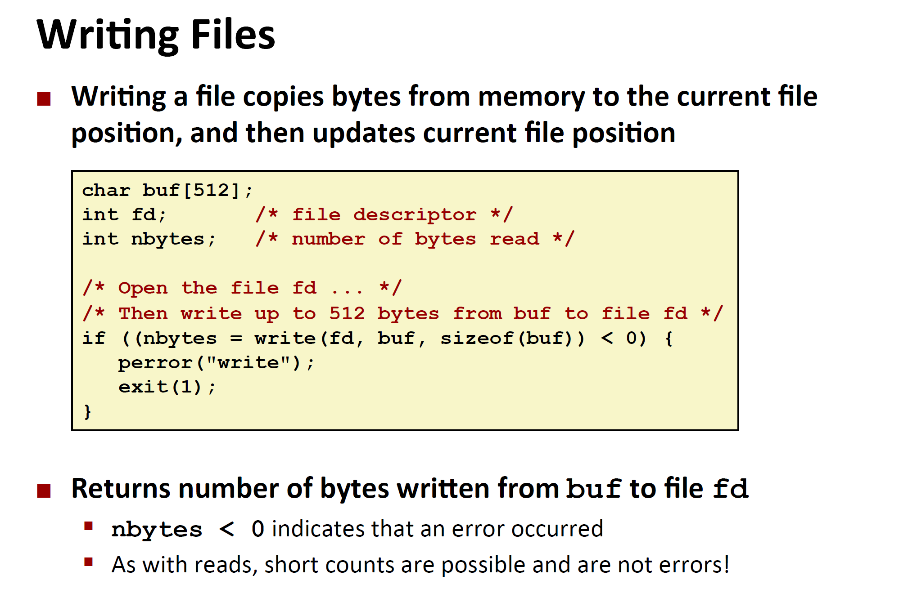
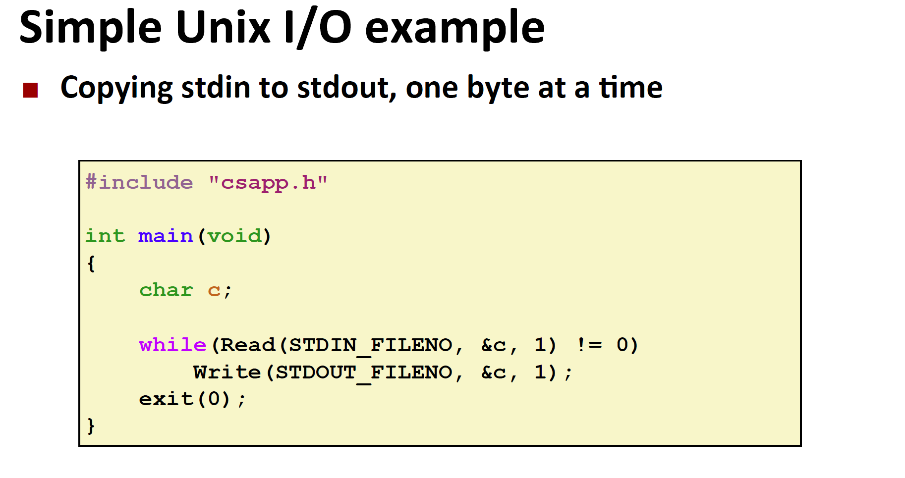
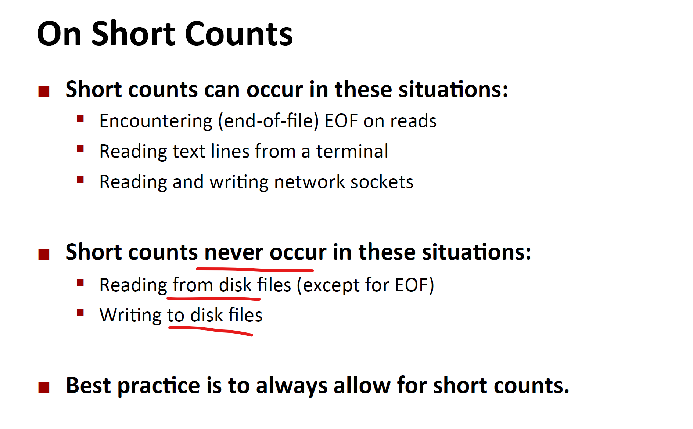
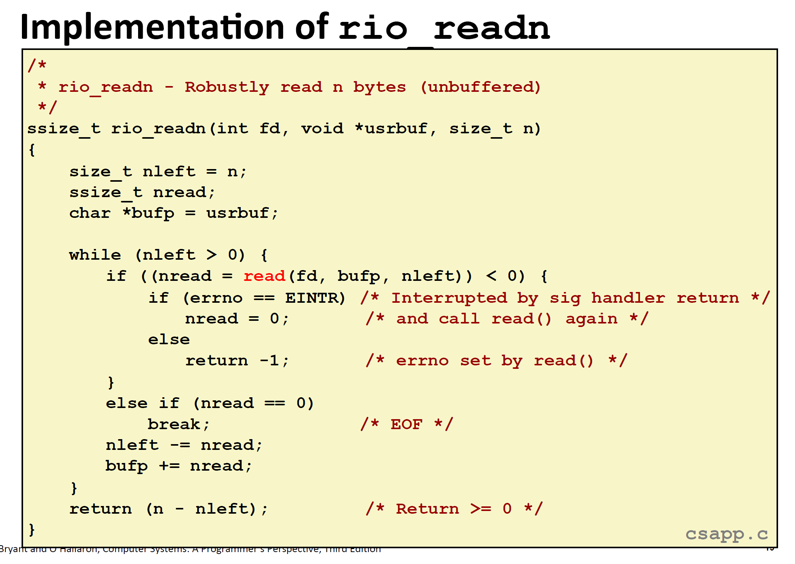
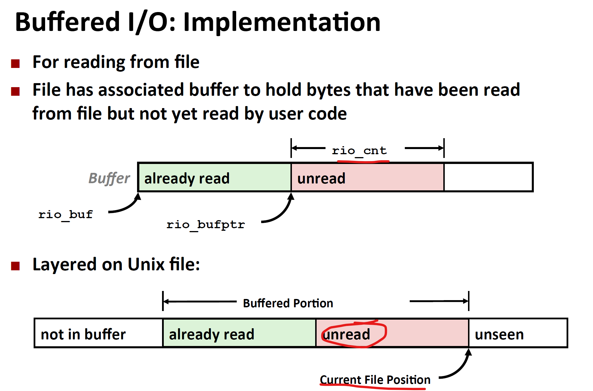

# 系统级I/O

## Unix I/O

### 概述

低等级的I/0，在Linux系统中，文件就是一系列的字符串，并且所有的I/O设备，比如disk/terminal/socket，都被看作是文件。甚至连内核kernel，都被看做是文件。

通过简单的打开，关闭，读，写等接口，open(),close(),read(),write()等，对文件（也就是这些I/O设备）进行操作。

当前文件位置：有一个指向当前文件中某一位置的指针K（current file position），帮助我们定位。（当前，那些terminal比如socket,type..没有此指针，因为是数据流）

### 文件类型

每个文件都有自己的唯一类型，常见包括：1，常规文件：随机信息。2，目录文件：指向文件的一组索引。3，socket：可以和其他机器的进程交换数据。4，管道：不同进程之间交换数据。

#### 常规文件

应用程序（非os），可以区分这些常规文件类型，包括文本文件（ASCII/Unicode），二进制文件（图片，.o，声音，视频）

其中，文本文件就是一系列的行组成的，不同操作系统用不同的行结束符，linux/mac，使用'\n'也就是0xa，也就是ASCII中的LF（Line fead），windows中，行结束符包括两个：CR：表示回车+LF：表示换行。

#### 目录文件

包含了一个"链接"数组。每一个链接指向一个文件名

每个个目录文件至少包含有两条link，其中.(dot)表示当前目录本身，..(dot dot)表示父目录

操作目录：mkdir:创建空目录，ls：查看目录内容，rmdir：删除空目录

目录层次结构如上所示。

可以使用绝对路径名和相对路径名来访问hello.c

### 操作文件

#### 打开文件

使用open("路径名"，选项)：选项包括RDONLY（只读）oppend（从尾部开始）等

**注意：调用系统函数一定要检查返回值**

fd: file descriptor：文件描述符，每打开一个文件对应一个fd，系统有限制最多打开的文件数，如fd<=1024

#### 关闭文件

也需要检查错误，因为在线程？？共享内存（数据）时，可能出现两个进程关闭同一个文件，从而一个进程会关闭已经关闭的文件，从而报错。

#### 读取文件

返回值有三种情况：0，表示读取到文件结束符（文件读完了），<0，表示没有读取到文件（报错），>0，表示读取到的字节数

会出现short counts：读取到的文件量比我们设置的要少

在一些terminal（shell?socket)：会先读取一定量的字节,然后再让OS read？

通过改变current file position K表示我们读到哪里了

可以指定我们要读多少数，不一定buf[512]全部读满

#### 写入文件

指定需要写入的文件（fd），然后在文件的current file position开始写入我们的数据。和read()类似，我们需指定要写入的字节数，也会出现写入的字计数比我们想要的少的情况。

#### 读写举例

非常糟糕的代码：一直在不断调用系统函数，所以一直在上下文切换，context switch会花费20000~40000个机器周期（使用strace可以追踪system call）

#### short counts

通常在terminal读取数据，以及在socket读取或者写入数据时，会出现short counts，我们需要**健壮的I/O接口**来处理short counts。

## 健壮的I/O文件包(RIO)

是系统I/O的包装（wrappers），能够对short counts(读写不足？)提供有效的解决方式。

提供两种类型的函数：没有缓存的input和output函数，有缓存的读取函数（input/read）

### Unbuffered RIO

没有缓冲的函数和unix的IO类型，不同点在于，rio_readn会一直读取直到EOF。rio_writen将不会发生写入不足（永久等待？）

理解源码！（[记得看RIO的全部源码](caspp.cs.cmu.edu/3e/code.html)）

### Buffered RIO input

在读取文件时使用，会预先读取一段文件存入buffer（其中有没有被user读的文件），当Buffer的文件全部读完后，在调用unix I/0读取文件，从而减少系统调用次数。

