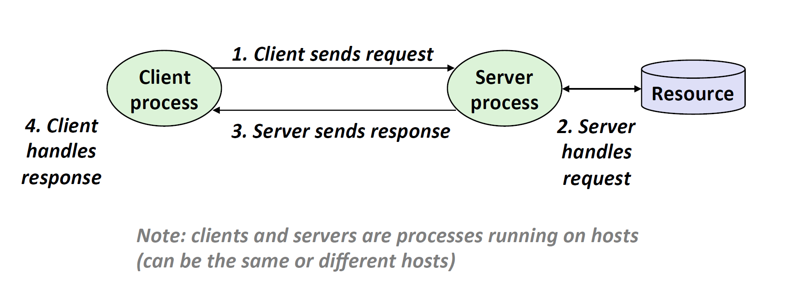
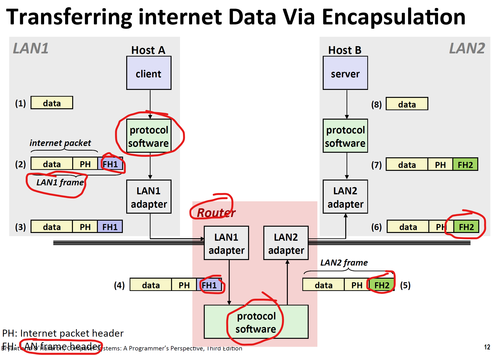
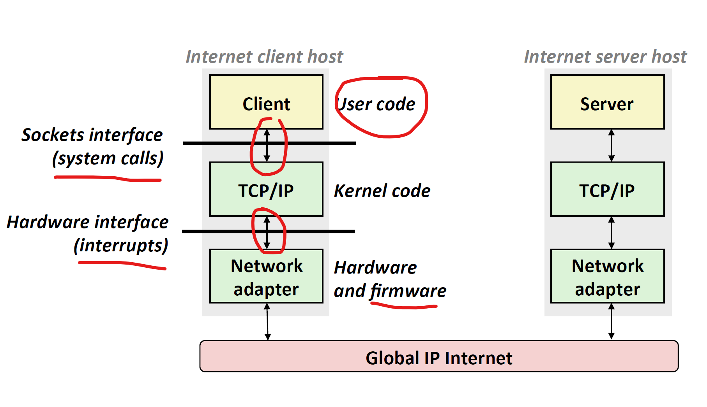

# 网络编程

### 前提

重点讲编程，网络的数据如何传输，路由器，集线器，以太网，局域网等等知识，看“计算机网络”即可。

一些图：

### 协议

由于存在着不同的LANs和不同的WANs，数据应该怎样在不同的设备上传输呢？

解决办法：每一台主机或者路由器上，都有一层协议软件，能够帮助不同主机和路由器之间进行数据传输（比如一致的命名方式，唯一标识主机），还能够消除不同网络的差异（不同网络可能采取不同的数据封装方式，协议提供统一的封装格式，帮助网络间的通信）总的来说，协议做了两件事：

1. 提供了命名机制
2. 提供了传输机制（标准传输单元：包）（包包括：头部/有效部位）

**数据通过封装在网络中传输**

注意：路由器会对发来的数据报（包）进行重新封装（添加了FH2）

### 因特网

基于TCP/IP协议族：

其中IP提供了基本的命名机制以及提供**不可靠的主机-主机间**的数据报（包）传输。

UDP：使用IP来提供**不可靠的进程-进程间**的通讯

TCP：使用IP来提供可靠的比特流，进程-进程间，通过连接。

**英特网应用程序**：

在程序员眼中，一个主机和一个IP地址对应，IP地址和域名对应（如www.google.com对应着特定的IP地址）不同主机的进程可以通过连接（connection）进行通信。

**IP地址**

32位，存储在IP address struct，并且是大端序列。

32位的IP地址还可以用点分割的十进制表示，两点之间的数为一个字节（最大255）

**域名**

域名有多个等级，并由DNS（域名系统）管理，DNS能够维护IP地址和域名的对应，是一个很大的分散数据库。

在程序员严重，DNS就是有着很多主机项（host entries）的数据库，每条主机项对应着域名和IP地址的映射。

使用nslookup可以查询主机项。比如：nslookup localhost可以得到路由器的回环地址（loopback address）

nslookup hostname：获得本机真实域名 nslookup www.google.com获得谷歌的IP地址（可以发现多次查询会不同）

**因特网连接**

用户和服务器通过连接进行通信，连接的特点：

1. 点对点：连接着一对进程
2. 完全双向：能够在同时双向传递数据
3. 可靠

socket：连接的终端：一个socket由IP地址加上接口(port)组成。

接口(port)：16位（两个字节），用来表示进程，常见的接口有：随机接口（用户端的内核把随机接口自动的分配给进程）。著名接口：与常见的一些服务进程相关（如port 80：表示网页服务）

常见接口：echo server：7/echo，ssh server :22/ssh，email server：25/smtp，Web servers：80/http

可以在/etc/services中查询这些常见接口（Linux）。