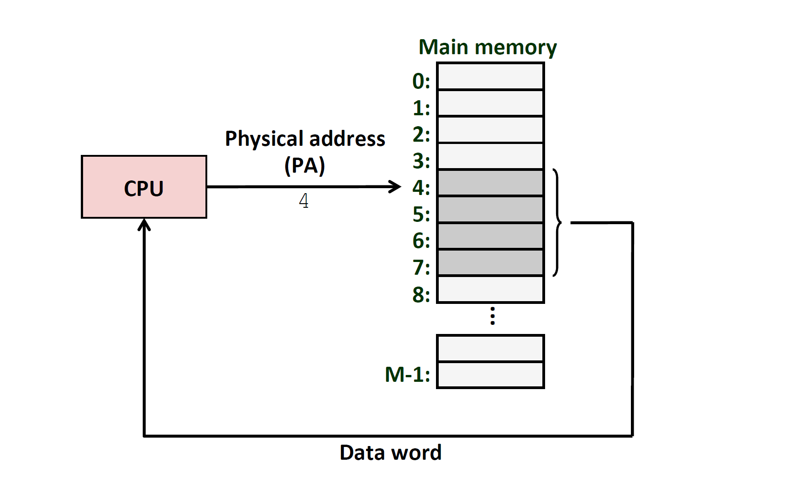

# 虚拟内存：概念

## 地址空间

### 两种不同系统

有一些系统如汽车，电梯内的控制设备，系统较简单，使用的是直接物理地址，CPU访问内存（main memory）时直接使用物理地址（physical address,PA),如下图所示：

服务器或者电脑上的系统，CPU访问内存时，使用的是虚拟地址（virtual address,VA），把VA发送给MMU（内存管理单元），进行地址转换（address translation），生成了PA，在从内存中取数据，发送给CPU。

### 地址空间术语

1. 地址空间：整数地址的集合
2. 线性地址空间：连续的非负整数地址集合
3. 虚拟地址空间：大小为2^n的连续地址空间
4. 物理地址空间：大小为2^m的连续地址空间

一般来说，n>m

### 为什么要使用虚拟内存？

每次访问内存，都需要经过MMU来转换，这样难道不会降低效率吗？首先理解虚拟化：

**虚拟化**是指拦截对某个资源的访问权限，提供对资源的抽象，对用户展现不同视图，比如磁盘，通过磁盘管理器的虚拟化，CPU看到的只是连续的逻辑块，而不是磁盘，磁道这些物理设备，对磁盘的读写操作，被磁盘管理器拦截。

使用虚拟内存的优点

1. 能够更有效率的使用DRAM（因为DRAM也就是主存，称为了VM的cache）
2. 能够简化内存管理（每个进程都有相似的连续地址空间）
3. 能够帮助我们分离地址空间，实现数据保护（不同进程的虚拟内存是不一样的，用户程序不能访问内核的代码和数据）

## 虚拟内存作为缓存的工具

### 虚拟内存和物理内存

VM：长度为N的连续地址，存在磁盘上

PM：作为VM的缓存，存在DRAM上

可以发现：

VM被很多块，被称为页面（pages），其中VM中的称为虚拟页面VP，被缓存在PM中的块称为物理页面，PP。

页面的大小为2^p，通常比之前学到的缓存块大。（4096个字节，4kB）

同时VM上还有一些页面是空的，称为未分配(unallocated)，也有些分配了但是没被缓存的（uncached）。

### DRAM缓存

DRAM作为缓存，会有很严重的未命中惩罚，因为从磁盘取数据非常慢，所以我们采取以下措施，来提高命中率

1. 使用大的cache block，称为页面（4KB/4MB）
2. 完全关联性：任何的VP都有可能放在任何的PP，而不是像缓存那样有限制（需要map function）
3. 非常复杂的替换算法：为了尽量减少未命中，不能简单的使用缓存那样的LCU算法（而且是在软件级实现）
4. 不能使用直接写(write through)，使用回写（write back）

### 页表

页表是由页表项组成（page table entries（PET））组成，每一个页表项都对应着一个（VM,PM）对（有效位为1时）

#### 页表命中

当CPU所需的虚拟地址在页表中能找到对应的PET，此时便可在DRAM中找到对应物理地址，从而page hit!

## 虚拟内存作为内存管理的工具

## 虚拟内存作为内存保护的工具