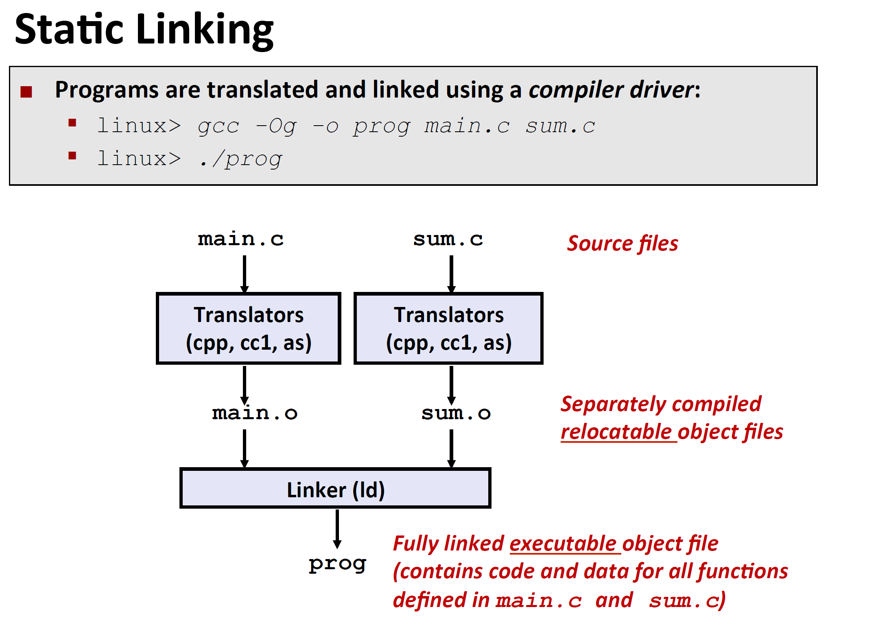
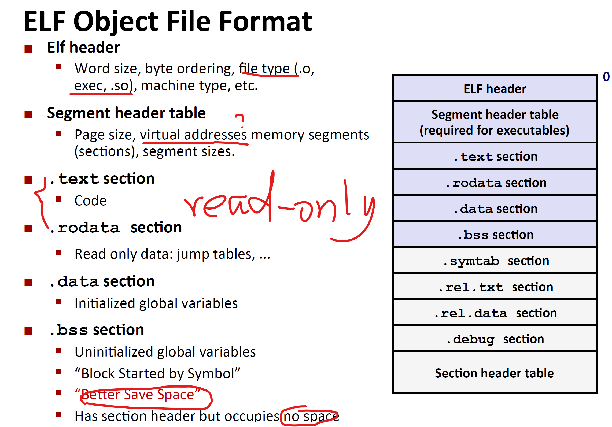
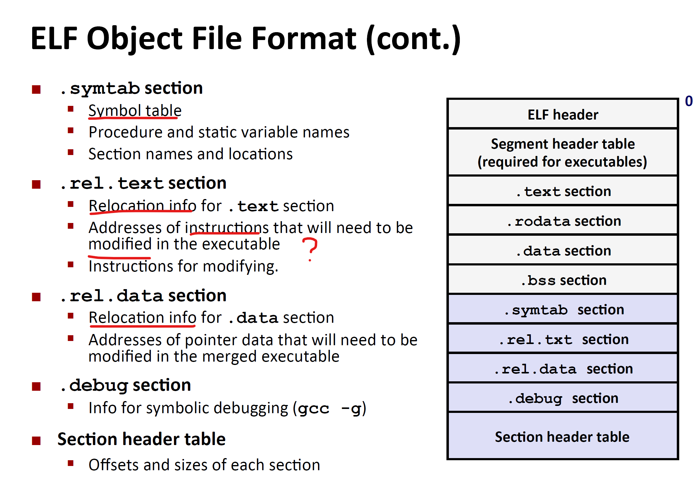
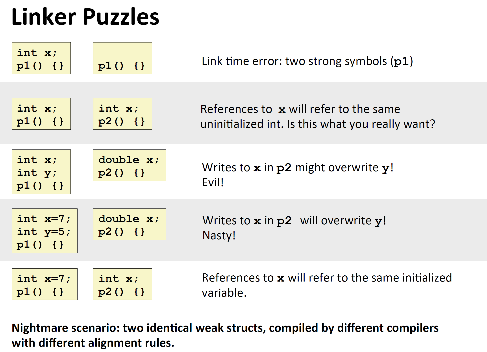
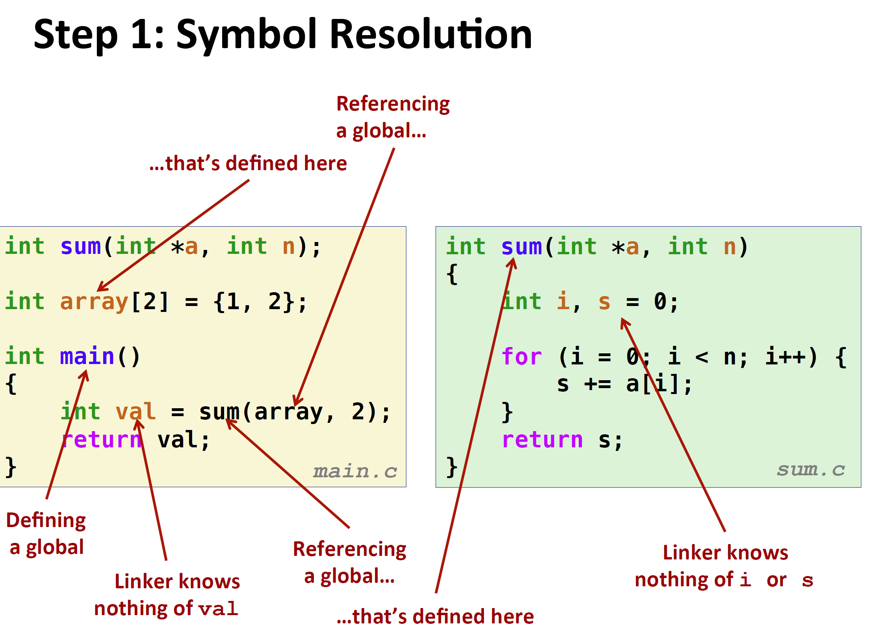
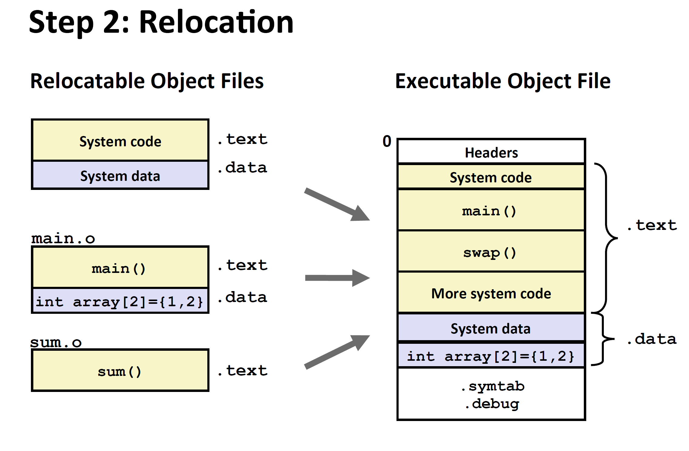
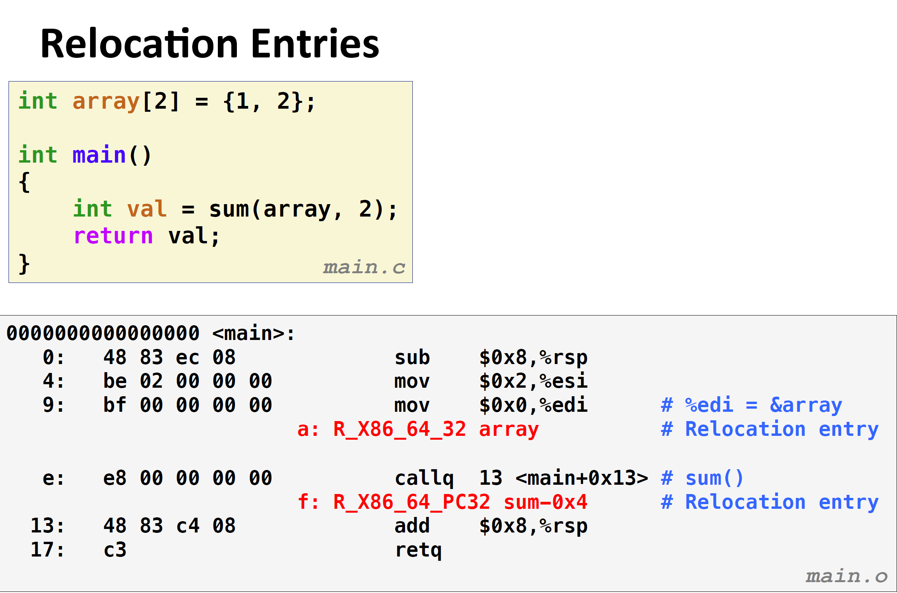
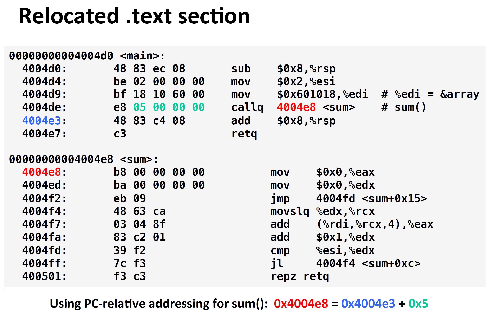
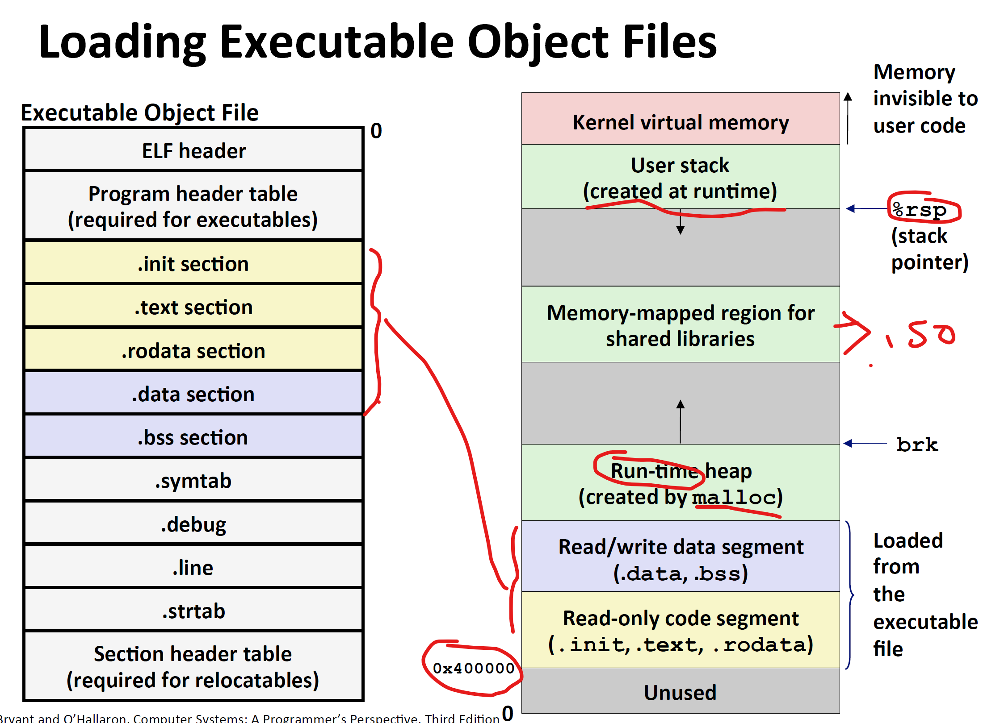

# 链接

## 链接详解

### 静态链接例子

  对于两个.c文件，如何形成可执行的目标文件呢？

  两个源代码分别经过预处理编译器，编译编译器，汇编编译器，生成了两个可重定向的目标文件，再经过链接器，链接成可执行目标文件。

### 链接器优势

1. 模块化：程序是由许多小的源文件组成，而不是大的单一文件。并且能构建包含许多函数的库。
2. 提高效率：节省时间：当修改源文件时，只需要重新编译那个修改的源文件，而不需要重新编译其他源文件。节省空间：公用的函数压缩成库，函数调用库时，只需要加载库中的某一些函数。

### 链接器的工作步骤

1. 符号解析（简单解析）
   1. 程序能够定义和引用符号（全局变量或者函数）
   2. 这些符号（全局变量/函数）的定义在目标文件（.o)中以符号表的形式保存着，每一个符号对应着名称，大小，符号位置（以structs形式）
   3. 在符号解析阶段，链接器将每一个符号引用和其定义（名称，大小，符号位置）一一对应。
2. 重定位阶段
   1. 目的是将分开储存的数据和代码组合成**单一区域**
   2. 重定位：由符号的相对位置，找到其绝对位置
   3. 更新符号引用中的位置为它们的绝对位置？？

### 一些定义

- 三种目标文件（object files）（模块）

  - 重定向目标文件（.o file）（汇编器生成的二进制文件）：不能直接加载当内存，需要等待链接器的链接，其中数据和代码以某种形式存储（ELF），每一个.o文件对应着一个源文件。
  - 可运行目标文件（a.out file）能够直接加载到内存并运行
  - 共享目标文件（.so file）（共享库）：特殊的重定向目标文件，能够在**加载时间？？**和运行时期动态的载入内存和动态链接，在windows中称为dll文件。

- 可执行可链接格式（ELF）

  针对二进制目标文件（上面三种）的标准格式，所以上面三种文件又称为ELF二进制。

  这种二进制文件的格式如下图所示：每一部分都有详细划分。

  .bss文件储存未初始化的全局变量。

  

### 链接器符号/链接步骤

- 链接器符号
  - 全局符号（global symbols)：在模块m中定义，并能被其他模块引用的符号，比如non-static 函数或者non-static 全局变量
  - 外部符号（external symbols）：在模块m中被引用，在其他模块被定义的全局符号
  - 局部符号（local symbols）：在模块m中定义，只能在模块m中引用的符号，比如static的函数和全局变量。
  - 区分局部非静态变量和局部静态变量：local non-static存在stack上，local static存在.bss或者.data
  - 强符号/或符号：强符号：过程/已经初始化的全局变量，弱符号：未初始化的全局变量，不允许多个同名强变量，但允许多个同名弱变量，会随机选择一个初始化。**一定要避免弱变量，很容易出Bug**

* 全局符号使用原则：尽可能static，尽可能初始化，尽可能声明external

>
>
>
>
>
>
>

* 链接步骤

  * 符号解析：确定目标文件中的符号表

    

  * 重定向

    

  可以发现：重定向需要重新规划各个重定向目标文件的.text./data section的地址，从而组成可执行目标文件的.text和.data

  

  可以发现：对于那些需要定位地址的部分，如array的地址和sum函数的地址，都用00000000代替，然后使用了relocation entry，这些entries可以帮助linker有足够的信息，组成可执行的目标文件（详细解释见教材，视频也没怎么讲）

  

  可以发现：之前array和sum的地址确定了！（之前好像用的相对地址）然后main函数好像就是紧接在system code的后面。

  这张图的困惑：1，为什么要多开8个字节的stack呢，明明callee个caller使用寄存器来共享数据呀

  2，程序计数器（rpi）的相对地址是什么东西。

* 最后，可执行文件被加载到内存，如下图所示

  

上图针对linux系统，程序开始地址0x400000，有一段内存映射区域供共享库使用。